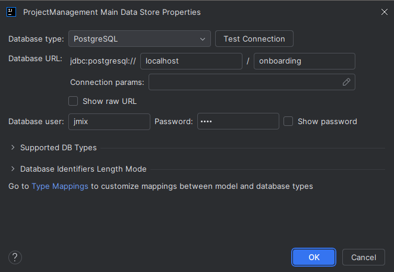
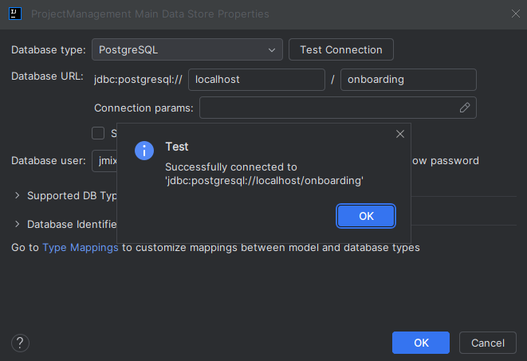

# Jmix Superset

## Índice
1. [Introducción](Superset.md#Introducción)
2. [Configuración](Superset_config.md#Configuración)
3. [Dataset](Superset_dataset.md#Dataset)
4. [Gráficos](Superset_graficos.md#Gráficos)
5. [Dashboard](Superset_dashboard.md#Dashboard)

## Configuración

### Instalación de Apache Superset

En este caso veremos cómo instalar Apache Superset mediante el uso de Docker Compose.

En primer lugar, clona el repositorio de Superset con una etiqueta, por ejemplo su versión:

```bash
git clone --depth 1 --branch 4.0.1 https://github.com/apache/superset.git
```

Después, especifica la misma versión para la imagen de docker para Apache Superset en el archivo `docker-compose-non-dev.yml` ubicado en el directorio del repositorio clonado. Abre el archivo `docker-compose-non-dev.yml` y establece el siguiente valor en la propiedad `x-superset-image`:

```yaml
x-superset-image: &superset-image apache/superset:4.0.1
```
Por último, configura un servicio de base de datos que será accesible tanto para Superset como para la aplicación.

Agrega el servicio de PostgreSQL a `docker-compose-non-dev.yml`:

```yaml
  superset-worker-beat:
  # ...

  jmix_database:
    image: postgres:16.3
    container_name: jmix_database
    ports:
      - 5432:5432
    environment:
      POSTGRES_DB: onboarding
      POSTGRES_USER: jmix
      POSTGRES_PASSWORD: jmix

volumes:
# ...
```
> [!CAUTION]
>En caso de que tengas PostgreSQL local usando el puerto 5432, puedes sustituirlo para evitar conflictos:
>
>```yaml
>ports:
>    - 5433:5432
>```

Ejecuta el siguiente comando en el directorio del repositorio clonado para lanzarlo:

```bash
docker compose -f docker-compose-non-dev.yml up
```

Para acceder a la interfaz de usuario de Superset (UI), dirigete a http://localhost:8088. Las credenciales son `admin / admin`


### Configuración de Apache Superset

Superset permite la definición de configuraciones personalizadas en los siguientes archivos:

- `docker/pythonpath_dev/superset_config.py`
- `docker/pythonpath_dev/superset_config_docker.py`

En este caso, utilizaremos el segundo archivo. Crea el archivo `superset_config_docker.py` en el directorio `/apache-superset/superset/docker/pythonpath_dev/`.

#### Guest Token

El plugin Jmix Superset utiliza un `guest token` para acceder a los dashboards incrustados. Este token permite a Superset crear un usuario anónimo con un rol definido por la propiedad `GUEST_ROLE_NAME`, que por defecto es `Public`. Para permitir que los usuarios anónimos vean los paneles, se debe utilizar el rol `Gamma`.

Añade la siguiente propiedad al archivo `superset_config_docker.py`:

```python
GUEST_ROLE_NAME = 'Gamma'
```
#### Dashboards incrustados

Por defecto, Superset no permite incrustar dashboards en `iframe`. Para habilitar esta funcionalidad, se utiliza la propiedad FEATURE_FLAGS.

Añade la siguiente propiedad al archivo `superset_config_docker.py`:

```python
FEATURE_FLAGS = {
    "EMBEDDED_SUPERSET": True,
}
```

#### Política de Seguridad de Contenido (CSP)

Para incrustar paneles en `iframes`, también es necesario configurar la ´Política de Seguridad de Contenido (CSP)´. Superset utiliza `Talisman`, una extensión que permite integrar capas adicionales de seguridad como CSP, HTTPS, etc.

Superset ya tiene definida la propiedad TALISMAN_CONFIG con valores por defecto en superset/config.py.

Copia la propiedad TALISMAN_CONFIG al archivo superset_config_docker.py y añade el valor frame-ancestors:

```python
TALISMAN_CONFIG = {
    "content_security_policy": {
        # ...
        "frame-ancestors": ["http://localhost:8080"]
    },
    # ...
}
```

El resultado final del archivo `superset_config_docker.py` debería ser el siguiente:

```python
GUEST_ROLE_NAME = 'Gamma'
FEATURE_FLAGS = {
    "EMBEDDED_SUPERSET": True,
}
TALISMAN_CONFIG = {
    "content_security_policy": {
        "base-uri": ["'self'"],
        "default-src": ["'self'"],
        "img-src": [
            "'self'",
            "blob:",
            "data:",
            "https://apachesuperset.gateway.scarf.sh",
            "https://static.scarf.sh/",
        ],
        "worker-src": ["'self'", "blob:"],
        "connect-src": [
            "'self'",
            "https://api.mapbox.com",
            "https://events.mapbox.com",
        ],
        "object-src": "'none'",
        "style-src": [
            "'self'",
            "'unsafe-inline'",
        ],
        "script-src": ["'self'", "'strict-dynamic'"],
        "frame-ancestors": ["http://localhost:8080"]
    },
    "content_security_policy_nonce_in": ["script-src"],
    "force_https": False,
    "session_cookie_secure": False,
}
```

Ahora que Superset está configurado, puede ser reiniciado. Detén los contenedores que están en ejecución y vuelve a ejecutar el comando para ejecutarlos:

```bash
docker compose -f docker-compose-non-dev.yml up
```

### Configuración de Jmix

El plugin Jmix Superset necesita que se definan las siguientes propiedades en el archivo `application.properties`:

```properties
jmix.superset.url = http://localhost:8088
jmix.superset.username = admin
jmix.superset.password = admin
```

Cambia el tipo de almacenamiento de `HSQLDB` a `PostgreSQL` especificando los datos que hemos configurado anteriormente para que la conexión a la base de datos PostgreSQL se realice correctamente:

- **Tipo de base de datos**: `PostgreSQL`.
- **Nombre de la base de datos**: `onboarding` .
- **Usuario**: `jmix`.
- **Contraseña**: `jmix`.



Haz click en `Test Connection` para comprobar que la conexión a la base de datos se ha configurado correctamente.



La aplicación está lista para comunicarse con Superset.
